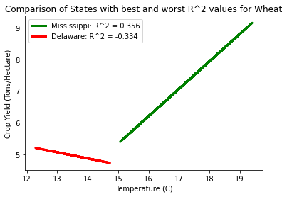

# Tech Report

### Our Hypothesis ###
Our project operates on the hypothesis that crop yield is inversely correlated with temperature, so we wish to see if we can reject the null hypothesis, that there exists no correlation between temperature and crop yield. Our metric for success in confirming our hypothesis is the statistical significance of the algorithm we use to model our data. We initially considered using LSTMs and similar neural networks, but we felt that these models would be too complex to capture the relationship between temperature and crop yield, which we intuitively felt should be linear. We therefore elected to use a linear regression to model our data, and we measured the success of this model by analyzing the R2 of our regression line and comparing this to the p-value we calculate by performing a t-test on our regression line. 

#### Preprocessing ####
In preprocessing our data for regression and analysis, we faced the issue of whether or not we should divide our data, and how we should if we chose to do so. We chose to initially perform our analysis on all US data, and then compare these results to our analysis done state by state. In order to perform the latter analysis and be able to cluster our dataset by state, we had to slightly restructure our data to sort each set of coordinates into their respective states and add this attribute to our dataset.

### Regression Analysis on US Data ###
We initially performed our regression analysis on all US data for each crop. Our results are as follows, and the R2 of the regression lines for each of the four crops is 0.0, which fails to suggest any kind of relationship between temperature and crop yield for the data across the US.

 

 

We failed to see any significant relationship between temperature and crop yield for any of the crops in the overall US data, and we also observed that the aggregation of data points visually suggested that there was no correlation between the two variables. As such, we then elected to perform this analysis specific to each of the 48 contiguous states in the US. 

### Regression Analysis State by State ###

Surprisingly, we again found no significant relationship between temperature and crop yield for each of the 48 US states across all crops. 

 

 

Our average R2 score for all of the states was 0.08 for maize, 0.09 for wheat, 0.04 for rice, and 0.06 for soybean, which we did not find to be statistically different from our R2 scores of 0.0 for our analysis over all US data. We thought it might be productive to consider the state yielding the maximum R2 score for each crop. Doing so showed that our results were still not statistically significant for any individual state: our maximum R2 scores are 0.39 for maize in the state of New Jersey, 0.36 for wheat in the state of Mississippi, 0.29 for rice in the state of Texas, and 0.44 for soybeans, again in the state of New Jersey. With these inconsistent and insignificant R2 values, we are not able to reject our null hypothesis. 

#### R-Squared Plot ####

To further illustrate the inconsistencies in our R2 values when modeling state by state, we have included the following plot of the range of our R2 values for each crop. As can be seen, the mean R2 value is 0.0, and R2 values range from the maximum values stated above to negative values of similar magnitude.

  

#### T-Test Results ####

We further verified this conclusion by performing a t-test on each of our regression lines, and shown below is the t-test results evaluated on our models using all US data. As can be seen, our p-values are not significant enough to reject the null hypothesis.

| Crop     | Mean of Test Residuals | One Sample t-statistic | One Sample p-value | Independent T-test t-statistic | Independent T-test p-value |
|----------|------------------------|------------------------|--------------------|--------------------------------|----------------------------|
| Wheat    | 7.3773                 | 181.1982               | 0.0                | 1.2943                         | 0.1955                     |
| Maize    | 4.5373                 | 111.9525               | 0.0                | -0.2412                        | 0.8094                     |
| Rice     | 9.2234                 | 117.9709               | 0.0                | 0.4649                         | 0.6420                     |
| Soybeans | 9.5427                 | 211.6966               | 0.0                | -0.3482                        | 0.7277                     |

Comparing the residuals of the test set to the mean of zero in a one-sample t-test, we got p-values of 0.0 for all four crops. This means that we can reject the null hypothesis of the one sample t-test (that the mean is equal to 0), and accept the alternative: that the mean is not significantly similar to 0. Then, looking at the results comparing the residuals of the test set to the residuals of the training set, the p-values (which are greater than 5%) show that we cannot reject the null hypothesis (that the difference between the means is not equal to 0), so we can’t assume that the mean values of those sets of residuals are different. From these two tests we see the following: 1) the average difference between the predicted values of the test set and the actual values of the test set cannot be said to be 0, so there is some inaccuracy in our model’s prediction when using the entire US dataset; 2) the averages of the training and test residuals cannot be said to be statistically different, so the model is performing about as well on the training set as it is on the testing set. All together, we can conclude that, when using this overall US data, our linear regression model has significant faults. 

<b>Our full results can be found [here](../../Workspace/Code/linear_regression.ipynb).</b>

### Discussion ###
After realizing that we could not conclude that there exists any significant correlation between temperature and crop yield, we decided that the best way to illustrate our inability to come to a conclusion would be to display the varying or inconclusive results that we did get in performing our analysis. Our initial intuition was to perform our crop yield vs. temperature regression across all US data, and after seeing that the data was so disparate that there was no way of generalizing a trend from it, we wanted to show this result and compare it to the results we achieved by doing this analysis state by state. However, we still did not find any consistent results in our state-wise analysis, so we elected to show this by comparing the different correlations suggested by our best and worst R2 values for each crop. As can be seen with our highest R2 value, our best indicator of correlation, the highest R2 value of 0.44 for soybeans grown in New Jersey suggests a negative correlation between temperature and crop yield. However, the highest R2 value for a different crop suggests a positive correlation between temperature and crop yield, the R2 value being 0.36 for wheat grown in Mississippi. As some of our results directly contradict our initial hypothesis, we believe that this points to external factors, like improvements in technology, that we may not be considering in our model.

Seeing that our model is not accurate enough to predict future examples using the dataset, we plan to visualize the raw data in a form similar to the [Gapminder visualization](https://observablehq.com/@mbostock/the-wealth-health-of-nations), where we can show the relationship between crop yield and temperature over time. We would have 48 nodes, representing each of the contiguous US states, with our independent variable being average temperature and our dependent variable being average yield. Our interactive components would allow a user to view the changes over the span of the 33 years included in our dataset, 1981 to 2014, by using a pause/play button. The user can also select to see a certain year’s data by choosing from a slider displaying the included years. We will have four such visualizations for the four crops, and users will be able to click a button to indicate which crop they would like to view a graph for.

 - - - -
 ### Data Specs ###
 
 The data of yield of crops is from Iizumi, Toshichika (2019): Global dataset of historical yields v1.2 and v1.3 aligned version. PANGAEA, https://doi.org/10.1594/PANGAEA.909132. The data of global average temperature is from NASA, https://climate.nasa.gov/vital-signs/global-temperature/. We have collected data organized by longitude and latitude from U-Delaware for temperature. Both datasets were uniformly distributed across the globe in 0.5 degree increments. We had to do a significant amount of preprocessing in order to be able to condense the data into a set we could perform computations on. From ~200,000 entries per crop per year, we used a bounding box to reduce the data to only include coordinates found in the US. This greatly reduced our dataset, we now had ~5000 entries per crop per year, which would still require heavy computation but be much more manageable. There was no duplicate data, but we did have many missing values to consider; at locations where a crop was not grown, the corresponding coordinates were still included in the downloaded dataset, which we had to change to be 0.0 yield. We also had to exclude these data points when performing our analysis, as the fact that no crop was grown there was not indicative of the temperature affecting the region, but rather this location not being a viable place to grow that specific crop. We then again used bounding boxes to assign each coordinate to the US state it corresponds to, and later clustered by state in performing our analysis. The final dataset consists of 4 tables, one for each major crop in our analysis. In each of these tables, the rows are indexed by longitude-latitude coordinates, and the attributes of the rows are: yields for years 1981-2014 (each comprising an attribute), average temperatures for years 1981-2014 (each comprising an attribute), and the state the point is located in; 67 attributes in total. In this dataset, there are about ~4000 data points, each tied to a specific longitude-latitude coordinate.
